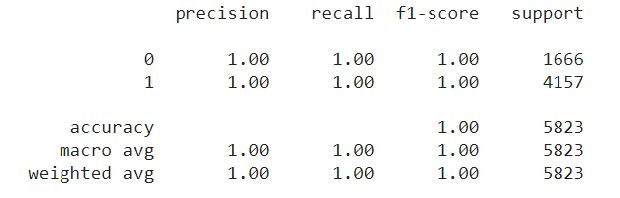
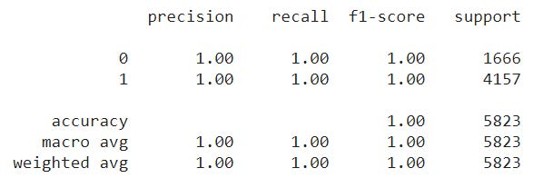
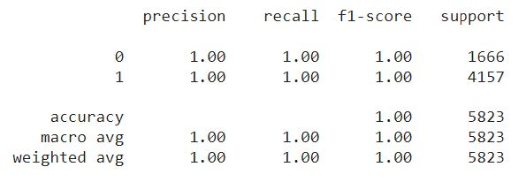

# Identifying Malicious/Non-Malicious Network Connections

The primary goal of this project is to analyze network traffic and detect potential cyber threats by identifying malicious connections. Using Python and advanced machine learning models, we preprocess the data, perform feature selection, and train models to distinguish between malicious and non-malicious connections with high accuracy.

## Directory Structure

## Dataset Used

The dataset used is derived from the Snort Intrusion Detection Log provided by the National Security Agency (NSA). It contains 34 features, such as:
- Source/Destination IP Address
- Protocol
- TCP Length
- Flags
- Priority Levels (1 to 4)

Some of the features that did not provide useful information for solving the problem of classifying the data have been removed. Further, data preprocessing steps such as missing value imputation and data normalization have been performed to prepare the dataset for model training.

## Methodology

The first step is to convert a log file which is in the form of ‘.txt’ to ‘.csv’ file with required features needed for the analysis. Now the ‘.csv’ file is read, and various pre-processing steps are applied like dropping irrelevant columns having NaN or null values, dropping rows where flag is not set and many more.

### Preprocessing Steps

As the dataset included 34 columns, I have selected the important features for our analysis as it is difficult to analyze such a high-dimensional dataset. 
- I removed all the individual columns of the flags, namely **Flag 1, 2, U, A, P, R, S, F**, and used a single column **“All Flags”** instead to understand the type of connection established. 
- Further, also dropped the **Protocol**, **ID**, and **IP Length** columns as they were not providing much information for classifying between malicious or non-malicious attacks.

As some of the columns, such as **Connection Classification**, **All Flags**, **NOP NOP TS**, **TCP Options**, **MSS**, **NOP WS**, and **SackOS TS**, included NA values, I followed appropriate methods to handle them.
 
- I have imputed the samples having NA in the **Connection Classification** column with `0`, as `0` would simply mean that there is no classification category information for these samples. 
- Further, I have used only those rows where the **“All Flags”** column had some value, as only those rows have an established connection. For the remaining dataset, we imputed the columns having NA values in **NOP NOP TS**, **TCP Options**, **MSS**, **NOP WS**, and **SackOS TS** with `0`.

Finally, I achieved a dataset with `0` NA values and applied **MinMax Scalar Transformation** to scale the features to a (0,1) range. This transformation was applied to prevent features with larger ranges from biasing the classification models.

### Machine Learning Pipeline

Pre-processing was applied on column name ‘ConnectionClassification’ to convert label data into binary classification problems. 

Initially the column contains ‘text’ as the type of attack recorded and ‘empty’ if it is not malicious. All the text is being converted to value 1(Malicious) and empty is replaced with value 0(non-Malicious).

The following supervised learning models were employed:

#### 1. XGBoost

#### 2. Random Forest

#### 3. AdaBoost

